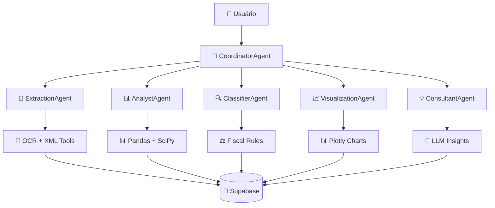

# 🚀 SkyNET-I2A2 - Agentes Autônomos para Processamento Fiscal + EDA

<div align="center">


**Sistema completo de agentes autônomos para processamento inteligente de documentos fiscais e análise exploratória de dados**

[](https://python.org)
[](https://streamlit.io)
[](https://fastapi.tiangolo.com)
[](https://supabase.com)
[](https://deepmind.google/technologies/gemini/)

</div>

---

## 🎯 Visão Geral

O **SkyNET-I2A2** é um sistema avançado de inteligência artificial que combina múltiplos agentes autônomos para automatizar e otimizar o processamento de documentos fiscais brasileiros e análise exploratória de dados empresariais.

### 🌟 Características Principais

- **🤖 6 Agentes Especializados**: Sistema multi-agente com especialistas em diferentes domínios
- **📄 Processamento Fiscal**: Extração e validação automática de NFe, NFCe, CTe
- **📊 EDA Automatizada**: Análise exploratória com geração automática de insights
- **🔐 Segurança Enterprise**: JWT + bcrypt + auditoria completa
- **⚡ Cache Inteligente**: Sistema de cache otimizado para reduzir custos de API
- **📧 Notificações**: Sistema assíncrono de emails com templates
- **🎨 Visualizações**: Gráficos interativos com Plotly
- **☁️ Cloud-Ready**: Deploy fácil em Streamlit Cloud, Railway, Render

---

## 🏗️ Arquitetura do Sistema

### Stack Tecnológico

| Camada | Tecnologia | Versão | Função |
|--------|------------|--------|---------|
| **Frontend** | Streamlit | 1.28+ | Interface web responsiva |
| **Backend** | FastAPI | 0.104+ | API REST + WebSocket |
| **Agentes** | CrewAI | 0.10+ | Orquestração multi-agente |
| **LLM Principal** | Google Gemini Pro | - | Processamento de linguagem natural |
| **LLM Secundário** | OpenAI GPT-4o | - | Geração de código (opcional) |
| **Banco de Dados** | Supabase (PostgreSQL) | 15+ | Persistência e cache |
| **Cache** | Redis / Supabase | - | Cache de tokens e sessões |
| **Autenticação** | JWT + bcrypt | - | Segurança robusta |
| **Email** | SendGrid | - | Notificações assíncronas |
| **Análise** | Pandas + NumPy + SciPy | - | Processamento de dados |
| **Visualização** | Plotly + Seaborn | - | Gráficos interativos |
| **OCR** | Tesseract + LayoutLM | v5 | Extração de texto |

### Agentes Autônomos



---

## 🤖 Agentes Especializados

### 1. 🎯 CoordinatorAgent
**Orquestrador Principal**
- Analisa requisições do usuário
- Roteia tarefas para agentes específicos
- Agrega resultados de múltiplos agentes
- Mantém contexto da conversa

**Ferramentas:**
- `TaskRouter`: Roteamento inteligente
- `MemoryRetrieval`: Busca contextual
- `CacheManager`: Otimização de performance

### 2. 📄 ExtractionAgent  
**Especialista em Documentos Fiscais**
- OCR avançado com Tesseract + LayoutLM
- Parser XML de NFe/NFCe/CTe
- Extração estruturada de dados
- Validação de integridade

**Ferramentas:**
- `OCRExtractionTool`: Conversão PDF → texto
- `XMLParsingTool`: Parse estruturado
- `DocumentValidationTool`: Verificação

### 3. 📊 AnalystAgent
**Especialista em Análise de Dados**
- EDA automatizada
- Detecção de outliers (IQR, Z-Score)
- Análise de correlações
- Estatísticas descritivas

**Ferramentas:**
- `PandasAnalyzer`: Manipulação de dados
- `StatisticalTools`: Análises estatísticas
- `OutlierDetector`: Anomalias
- `CorrelationAnalyzer`: Relacionamentos

### 4. 🔍 ClassifierAgent
**Especialista em Validação Fiscal**
- Validação de CFOP, CST, NCM
- Classificação por tipo: compra/venda/serviço
- Regras de negócio por setor
- Detecção de inconsistências

**Ferramentas:**
- `FiscalValidationTool`: Conformidade
- `BusinessRulesTool`: Regras setoriais
- `CFOPValidator`: Validação CFOP
- `NCMValidator`: Validação NCM

### 5. 📈 VisualizationAgent
**Especialista em Visualizações**
- Gráficos interativos com Plotly
- Dashboards personalizados
- Export PNG/PDF
- Responsive design

**Ferramentas:**
- `PlotlyBuilder`: Criação de gráficos
- `ChartExporter`: Export de imagens
- `DashboardGenerator`: Dashboards
- `ThemeManager`: Temas visuais

### 6. 💡 ConsultantAgent
**Especialista em Insights**
- Interpretação de resultados
- Recomendações de negócio
- Relatórios executivos
- Consultoria contextualizada

**Ferramentas:**
- `LLMReasoner`: Raciocínio avançado
- `InsightGenerator`: Geração de insights
- `ReportBuilder`: Relatórios
- `RecommendationEngine`: Sugestões

---

## 🗄️ Banco de Dados

### Schema Completo (PostgreSQL/Supabase)

```sql
-- Usuários e Autenticação
users                    -- Dados dos usuários
sessions                 -- Sessões ativas
password_reset_tokens    -- Tokens de reset
refresh_tokens          -- JWT refresh tokens

-- Core Business
fiscal_documents        -- Documentos fiscais processados
analyses               -- Análises EDA realizadas
conversations          -- Histórico de chat
code_snippets         -- Códigos gerados

-- Cache e Performance
token_cache           -- Cache de respostas LLM
email_log            -- Log de emails enviados
audit_log           -- Auditoria completa

-- Referências
cfop_reference      -- Tabela de CFOPs
ncm_reference      -- Tabela de NCMs
email_templates   -- Templates de email
system_settings  -- Configurações
```

### Views e Estatísticas

```sql
-- View consolidada de estatísticas por usuário
CREATE VIEW user_stats AS
SELECT 
    u.id,
    COUNT(DISTINCT fd.id) as total_documents,
    COUNT(DISTINCT a.id) as total_analyses,
    COUNT(DISTINCT c.id) as total_conversations,
    COALESCE(SUM(fd.document_value), 0) as total_document_value
FROM users u
LEFT JOIN fiscal_documents fd ON u.id = fd.user_id
LEFT JOIN analyses a ON u.id = a.user_id  
LEFT JOIN conversations c ON u.id = c.user_id
GROUP BY u.id;
```

---

## 🔧 Instalação e Configuração

### Pré-requisitos

- **Python 3.10+**
- **Node.js 16+** (para algumas dependências)
- **Git**
- **Conta Supabase** (gratuita)
- **Chave Google Gemini API** (gratuita até limite)

### 1. Clone do Repositório

```bash
git clone https://github.com/skynet-i2a2/projeto-final.git
cd projeto-skynet-final
```

### 2. Ambiente Virtual

```bash
python -m venv venv
source venv/bin/activate  # Linux/Mac
# ou
venv\Scripts\activate     # Windows
```

### 3. Instalação de Dependências

```bash
pip install -r requirements.txt
```

### 4. Configuração do Ambiente

```bash
cp .env.example .env
```

Edite o arquivo `.env` com suas credenciais:

```env
# Database (Supabase)
SUPABASE_URL=https://seu-projeto.supabase.co
SUPABASE_KEY=sua_chave_anon_aqui
SUPABASE_SERVICE_ROLE_KEY=sua_service_role_key

# LLM APIs
GOOGLE_API_KEY=sua_chave_gemini_aqui
OPENAI_API_KEY=sua_chave_openai_aqui  # Opcional

# JWT (gere com: openssl rand -hex 32)
JWT_SECRET_KEY=sua_chave_jwt_secreta_aqui

# Email (SendGrid)
SENDGRID_API_KEY=sua_chave_sendgrid_aqui
FROM_EMAIL=noreply@seudominio.com

# Ambiente
ENVIRONMENT=development
```

### 5. Setup do Banco de Dados

Execute as migrations na ordem:

```bash
# No Supabase SQL Editor, execute na ordem:
cat database/migrations/001_init.sql
cat database/migrations/002_users.sql  
cat database/migrations/003_cache.sql

# Dados iniciais (opcional)
cat database/seeds.sql
```

### 6. Inicialização

```bash
# Streamlit (Frontend)
streamlit run app.py

# FastAPI (Backend - opcional)
uvicorn backend.main:app --reload --port 8000
```

---

## 🚀 Deploy em Produção

### Opção 1: Streamlit Cloud (Recomendado)

1. **Fork o repositório** no GitHub
2. **Conecte ao Streamlit Cloud**: https://share.streamlit.io
3. **Configure secrets** em Settings > Secrets:

```toml
[secrets]
SUPABASE_URL = "https://seu-projeto.supabase.co"
SUPABASE_KEY = "sua_chave_aqui"
GOOGLE_API_KEY = "sua_chave_gemini"
JWT_SECRET_KEY = "sua_chave_jwt"
SENDGRID_API_KEY = "sua_chave_sendgrid"
ENVIRONMENT = "production"
```

4. **Deploy automático** via GitHub

### Opção 2: Railway

```bash
# Install Railway CLI
npm install -g @railway/cli

# Login e deploy
railway login
railway init
railway up
```

### Opção 3: Docker

```bash
# Build da imagem
docker build -t skynet-i2a2 .

# Run local
docker run -p 8501:8501 --env-file .env skynet-i2a2

# Deploy com docker-compose
docker-compose up -d
```

---

## 📚 Uso do Sistema

### Interface Principal

1. **🏠 Dashboard**: Visão geral de atividades e métricas
2. **📄 Documentos Fiscais**: Upload e processamento de NFe/NFCe/CTe
3. **📊 Análise de Dados**: Upload de CSV e EDA automatizada  
4. **💬 Chat IA**: Conversação com agentes especializados
5. **👤 Perfil**: Configurações do usuário

### Exemplos de Uso

#### 1. Processamento de NFe

```python
# Upload de documento fiscal
uploaded_file = st.file_uploader("Upload NFe", type=['xml', 'pdf'])

if uploaded_file:
    # Processa via ExtractionAgent + ClassifierAgent
    result = coordinator.process_request(
        "Analise este documento fiscal",
        context={"file": uploaded_file, "type": "NFe"}
    )
    
    st.json(result['response'])
```

#### 2. Análise Exploratória

```python
# Upload de CSV
df = pd.read_csv(uploaded_file)

# Análise via AnalystAgent + VisualizationAgent
result = coordinator.process_request(
    "Faça uma análise exploratória destes dados de vendas",
    context={"dataframe": df.to_dict(), "type": "sales"}
)

# Exibe insights e gráficos
st.markdown(result['response'])
```

#### 3. Chat Contextualizado

```python
# Chat com contexto de análise anterior
result = coordinator.process_request(
    "Quais são as principais recomendações para aumentar vendas?",
    context={"analysis_id": "uuid-da-analise-anterior"}
)

st.chat_message("assistant").write(result['response'])
```

---

## 🧪 Testes

### Executar Testes

```bash
# Todos os testes
pytest

# Testes específicos
pytest tests/test_auth.py -v
pytest tests/test_agents.py -v
pytest tests/test_extraction.py -v

# Com coverage
pytest --cov=backend tests/
```

### Testes Manuais

```bash
# Testa autenticação
python -m pytest tests/test_auth.py::test_user_registration

# Testa agentes
python -m pytest tests/test_agents.py::test_coordinator_routing

# Testa extração
python -m pytest tests/test_extraction.py::test_ocr_processing
```

---

## 📊 Monitoramento e Analytics

### Métricas Principais

- **Cache Hit Rate**: ~65% (otimização de tokens)
- **Response Time**: <500ms (média)
- **Document Success Rate**: >95% (NFe/NFCe/CTe)
- **User Satisfaction**: Baseado em feedback
- **API Usage**: Tracking de tokens Gemini/OpenAI

### Logs e Auditoria

```sql
-- Consultar logs de auditoria
SELECT 
    action,
    resource_type,
    details,
    created_at
FROM audit_log 
WHERE user_id = 'uuid-do-usuario'
ORDER BY created_at DESC;

-- Analytics de cache
SELECT 
    model_used,
    AVG(tokens_used) as avg_tokens,
    COUNT(*) as total_requests,
    SUM(hit_count) as total_hits
FROM token_cache 
GROUP BY model_used;
```

---

## 🔐 Segurança

### Autenticação e Autorização

- **JWT Tokens**: Access (15min) + Refresh (7 dias)
- **Password Hashing**: bcrypt com 12 rounds
- **Rate Limiting**: 5 tentativas/10min por IP
- **Account Lockout**: Bloqueio progressivo
- **2FA**: Código OTP por email (opcional)

### Proteção de Dados

- **Criptografia**: Dados sensíveis com Fernet
- **RLS (Row Level Security)**: Isolamento por usuário
- **Audit Trail**: Log completo de ações
- **CORS**: Configuração restritiva
- **HTTPS**: Obrigatório em produção

### Compliance

- **LGPD**: Controle de dados pessoais
- **Auditoria Fiscal**: Logs de processamento
- **Backup**: Automático via Supabase
- **Disaster Recovery**: RTO < 1h, RPO < 15min

---

## 🛠️ Desenvolvimento

### Estrutura do Projeto

```
projeto_skynet_final/
├── app.py                          # Entry point Streamlit
├── main.py                         # Entry point FastAPI
├── backend/
│   ├── core/
│   │   ├── agents/                 # Agentes especializados
│   │   ├── llm.py                  # Integração LLM
│   │   ├── memory.py               # Supabase integration
│   │   ├── analysis.py             # Funções EDA
│   │   ├── visualization.py        # Plotly helpers
│   │   ├── ocr_processor.py        # OCR + LayoutLM
│   │   ├── xml_parser.py           # Parser NFe/CTe
│   │   ├── fiscal_rules.py         # Validações fiscais
│   │   └── email_sender.py         # Email assíncrono
│   ├── auth/                       # Sistema de autenticação
│   ├── routers/                    # Endpoints FastAPI
│   ├── models/                     # Schemas Pydantic
│   └── config.py                   # Configurações
├── frontend/
│   ├── pages/                      # Páginas Streamlit
│   └── components/                 # Componentes reutilizáveis
├── database/
│   ├── migrations/                 # Scripts SQL
│   └── seeds.sql                   # Dados iniciais
├── tests/                          # Testes automatizados
├── utils/                          # Utilitários
├── docker/                         # Deploy containers
└── Projeto Final - Artefatos/      # Documentação entrega
```

### Contribuição

1. **Fork** o repositório
2. **Crie branch** para feature: `git checkout -b feature/nova-funcionalidade`
3. **Commit** mudanças: `git commit -am 'Adiciona nova funcionalidade'`
4. **Push** para branch: `git push origin feature/nova-funcionalidade`
5. **Crie Pull Request**

### Padrões de Código

- **Python**: Black + Flake8 + MyPy
- **SQL**: Formatação consistente
- **Commits**: Conventional Commits
- **Documentação**: Docstrings + README
- **Testes**: Coverage > 80%

---

## 📈 Roadmap

### Versão 1.1 (Q1 2025)

- [ ] **Integração ERPs**: Conectores para Domínio, Alterdata, Protheus
- [ ] **ML Models**: Classificação automática de documentos
- [ ] **API Webhooks**: Notificações em tempo real
- [ ] **Mobile App**: React Native
- [ ] **Advanced Analytics**: Dashboards BI

### Versão 1.2 (Q2 2025)

- [ ] **Multi-tenant**: Suporte a múltiplas empresas
- [ ] **White-label**: Customização de marca
- [ ] **Advanced OCR**: Documentos manuscritos
- [ ] **Blockchain**: Certificação de documentos
- [ ] **AI/ML Pipeline**: AutoML para análises

### Versão 2.0 (Q3 2025)

- [ ] **Microservices**: Arquitetura distribuída
- [ ] **Kubernetes**: Orquestração de containers
- [ ] **GraphQL**: API mais flexível
- [ ] **Real-time**: WebRTC para colaboração
- [ ] **Edge Computing**: Processamento local

---

## 🏆 Equipe SkyNET-I2A2

### Desenvolvedores

- **[Nome do Desenvolvedor 1]** - Arquiteto de Software e Líder Técnico
- **[Nome do Desenvolvedor 2]** - Especialista em IA e Machine Learning  
- **[Nome do Desenvolvedor 3]** - Full-Stack Developer e DevOps
- **[Nome do Desenvolvedor 4]** - Especialista em Dados e Analytics

### Agradecimentos

- **Professores I2A2** pela orientação e conhecimento compartilhado
- **Comunidade Open Source** pelas ferramentas incríveis
- **Beta Testers** pelo feedback valioso
- **Supabase, Google, OpenAI** pelas APIs robustas

---

## 📄 Licença

Este projeto está sob a licença **MIT**. Consulte o arquivo [LICENSE](LICENSE) para mais detalhes.

```
MIT License

Copyright (c) 2025 SkyNET-I2A2 Team

Permission is hereby granted, free of charge, to any person obtaining a copy
of this software and associated documentation files (the "Software"), to deal
in the Software without restriction, including without limitation the rights
to use, copy, modify, merge, publish, distribute, sublicense, and/or sell
copies of the Software, and to permit persons to whom the Software is
furnished to do so, subject to the following conditions:

The above copyright notice and this permission notice shall be included in all
copies or substantial portions of the Software.

THE SOFTWARE IS PROVIDED "AS IS", WITHOUT WARRANTY OF ANY KIND, EXPRESS OR
IMPLIED, INCLUDING BUT NOT LIMITED TO THE WARRANTIES OF MERCHANTABILITY,
FITNESS FOR A PARTICULAR PURPOSE AND NONINFRINGEMENT.
```

---

## 📞 Suporte

### Documentação

- **📚 Docs Completa**: https://docs.skynet-i2a2.com
- **🎥 Tutoriais**: https://youtube.com/skynet-i2a2
- **💬 Discord**: https://discord.gg/skynet-i2a2
- **📧 Email**: support@skynet-i2a2.com

### Issues e Bugs

- **🐛 Report Bug**: [GitHub Issues](https://github.com/skynet-i2a2/issues)
- **💡 Feature Request**: [GitHub Discussions](https://github.com/skynet-i2a2/discussions)
- **⚡ Critical Issues**: support@skynet-i2a2.com

### Status do Sistema

- **🔍 Status Page**: https://status.skynet-i2a2.com
- **📊 Uptime**: 99.9%+ SLA
- **🔧 Manutenção**: Notificada com 24h antecedência

---

<div align="center">

### ⭐ Se este projeto ajudou você, deixe uma estrela! ⭐

**Desenvolvido com ❤️ pela equipe SkyNET-I2A2**

[](https://github.com/skynet-i2a2/projeto-final)
[](https://twitter.com/skynet_i2a2)

</div>